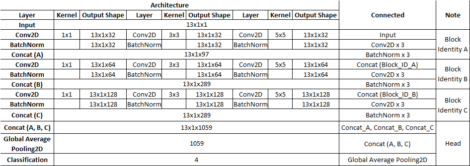

## Russ Proj Intrusion Detection

Implementation of paper - (loading...)

CNN architecture follow: 


## Quick Start
### Install lib
```shell
git clone https://github.com/ThangVu-Viet/Russia_Intrusion-Detection-System.git
cd intrusion-detection
pip install -r setup.txt
```

### Train Deep Model
```shell
python tools/dl-train.py \
-train "./dataset/full_data_std.data" \
-test "./dataset/full_data_test_std.data" \
-v "std-v1.0-relu" -ep 1000 -bsize 64 -verbose 1 \
--result_path "./runs/results" \
--training_path "./runs/training" \
-activation_block "relu" \
-status_ckpt True -status_early_stop True \
-name "model-relu-std-v1.0"
```

### Train Machine Model
```shell
python tools/ml-train.py -v "ml-tree-norm-v1" \
-train "./dataset/full_data_norm.data" \
-test "./dataset/full_data_test_norm.data" \
--result_path "./runs/results" \
--training_path "./runs/training" \
-name "tree"
```

### Structure as follows
    ├── intrusion-detection
    │   ├── core
    │   │   ├── deep_model.py
    │   │   └── machine_model.py
    │   │   └── utils.py
    │   ├── dataset
    │   │   ├── train.data
    │   │   └── test.data
    │   ├── docs
    │   ├── tools
    │   │   ├── dl-train.py
    │   │   ├── ml-train.py
    │   ├── LICENSE
    │   ├── README.md

